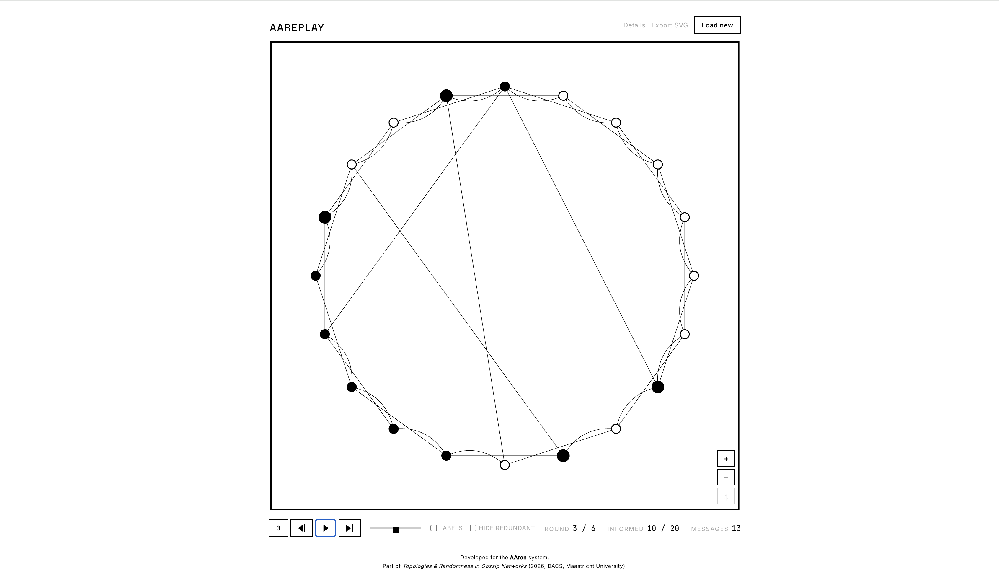

# AAreplay

A deterministic replay viewer for gossip-epidemic event logs.



```
  round 0     ●──○──○──○──○──○──○
  round 1     ●──●──○──○──○──○──○
  round 2     ●──●──●──○──○──○──○
  round 3     ●──●──●──●──○──○──○
  round …     ●──●──●──●──●──●──●     converged
```

AAreplay reads one recorded gossip simulation and reconstructs how a message spread through the network, round by round. It is a browser app: you load a single event-log file, watch the spread animate inside a square frame, and step, scrub, zoom, and inspect any moment of the run. It does not simulate anything itself. It is a faithful viewer for runs produced elsewhere.

AAreplay is the companion viewer to [**AAron**](https://github.com/Aladin000/AAron), the gossip simulator built for the bachelor thesis *Topologies & Randomness in Gossip Networks* (Matteo Cannata, Maastricht University, Department of Advanced Computing Sciences, 2026). AAron runs simulations and writes event logs; AAreplay plays them back.

> **AAron simulates and writes `result.json`. AAreplay plays it back.**
> AAreplay never runs a simulation of its own. It only visualizes what the file already records, which is exactly what keeps the picture an honest reflection of the run.

---

## Contents

- [Overview](#overview): what AAreplay shows you
- [Getting started](#getting-started): install, run, and your first replay
- [Interface](#interface): every control, at a glance
- [Replay files](#replay-files): the event-log format AAreplay accepts
- [How rendering works](#how-rendering-works): layout and drawing rules
- [Determinism](#determinism): why the same file always looks the same
- [Project structure](#project-structure): where everything lives
- [Extending AAreplay](#extending-aareplay): add a layout, panel field, or control
- [Building and testing](#building-and-testing): npm scripts and the test suite

---

## Overview

A replay file records one gossip run: a network, a starting (source) node, and an ordered list of rounds. In each round some informed nodes send the message to neighbours; some of those messages reach a node for the first time (a *new infection*), others land on nodes that already had it (*redundant*).

AAreplay turns that record into a picture:

- The network is laid out inside a square frame.
- **Hollow** nodes have not received the message yet; **filled** nodes have. The **source** node starts filled at round 0.
- Each round, **message pulses** travel along edges from sender to receiver, and newly reached nodes light up.
- If the file marks **failed nodes** (a Byzantine run, where some nodes receive but never forward), those nodes render in **red**.

Black ink on white paper. One square. No decoration. You can play the run, step a round at a time in either direction, scrub straight to any round, zoom and pan, click a node to inspect it, read the run's configuration and final metrics, and export the current frame as an SVG.

---

## Getting started

### 1. Prerequisites

| Dependency | Version | Needed for |
|---|---|---|
| Node.js | 20+ | running the dev server and build (Vite 8 toolchain) |
| npm | 10+ | installing dependencies (ships with Node) |
| Browser | evergreen | viewing the app (needs SVG 2.0 + SMIL animation) |

AAreplay is a pure front-end app with two runtime dependencies (React and Zod) plus `d3-force` for graph layout. There is no backend and nothing to configure.

### 2. Install and launch

```bash
git clone https://github.com/Aladin000/AAreplay.git
cd AAreplay/app
npm install
npm run dev
```

Open the URL Vite prints (default **http://localhost:5173**). A ready-to-use sample file ships at **`app/result.json`** (a 30-node random-topology run that fully converges at round 6), so you can see a real replay immediately.

### 3. Your first replay (a worked example)

1. With the dev server running, open the app. While nothing is loaded, the frame **cycles through example topologies** every few seconds. This is just a preview of the rendering style, not a real run.
2. Click **Load** (top right) and choose `app/result.json`. The network appears: the source node is filled, every other node is hollow, and the counter reads `round 0 / 6`.
3. Press **play** (`▶`). Message pulses animate along the edges, nodes fill in as they are informed, and the **Informed** count climbs toward `30 / 30`.
4. Press **pause** (`❚❚`), then drag the **scrubber** back to round 2 to inspect an earlier state. Step forward one round at a time with `▷`.
5. Toggle **Hide redundant** to drop the messages that did not cause a new infection, so only the spreading front remains. Toggle **Labels** to show node ids.
6. **Scroll** to zoom in at the cursor and **drag** to pan; click a node to pin a selection ring and read its id. Use the `⌖` button (bottom-right) to reset the view.
7. Click **Details** to read the run's configuration and final metrics, taken straight from the file.
8. Click **Export SVG** to download the current frame as a vector file.
9. Click the **AAReplay** title (top left) to return to the idle screen, or **Load new** to open a different file.

### 4. Where to go next

- Produce your own replay files → run [AAron](https://github.com/Aladin000/AAron) and load its `result.json` output here.
- Understand the file AAreplay expects → [Replay files](#replay-files).
- Change how runs are drawn or add a control → [Extending AAreplay](#extending-aareplay).

---

## Interface

```
  AAReplay                                [ Details ] [ Export SVG ] [ Load ]
  ┌──────────────────────────────────────────────────────────────────────┐
  │                           ○───●───○                                  │
  │                          ╱    │    ╲                                 │
  │                         ●     ●     ○                                │
  │                          ╲    │    ╱                                 │
  │                           ●───○───○                                  │
  └──────────────────────────────────────────────────────────────────────┘
   ◀◀  ◁  ▷  ▶   ├──────────●───────────────────┤        round 7 / 24
                 scrubber                              ● informed · ○ not
```

| Control | Where | What it does |
|---|---|---|
| **Load** / **Load new** | top right | open a `result.json` event log |
| **Details** / **Hide details** | top right | toggle the configuration and result panels |
| **Export SVG** | top right | download the current frame as a vector file |
| **`◀◀`** reset | playback bar | jump back to round 0 |
| **`◁` / `▷`** step | playback bar | move one round backward / forward |
| **`▶` / `❚❚`** play / pause | playback bar | auto-advance roughly one round per second |
| **scrubber** | playback bar | drag to jump straight to any round |
| **Labels** | playback bar | show or hide node ids |
| **Hide redundant** | playback bar | hide messages that did not cause a new infection |
| **`+` / `−` / `⌖`** | bottom-right of frame | zoom in, zoom out, reset zoom and pan |
| scroll / drag | on the frame | zoom at the cursor / pan the view |
| click a node | on the frame | pin a selection ring and reveal its id |
| **AAReplay** title | top left | return to the idle (home) screen |

The footer shows **Round** (current / total), **Informed** (count / total nodes), **Messages** in the current round, and, for Byzantine runs, a **Failed** count.

---

## Replay files

AAreplay accepts JSON event logs with `formatVersion "1.0"`. Every file is validated in two stages before playback: **structure** (shape and types) and **semantics** (the round-by-round story has to be internally consistent). An invalid file is rejected with a specific error message rather than rendered incorrectly.

**Required fields:**

| Field | Description |
|---|---|
| `configuration.nodeCount` | number of nodes (ids `0 .. nodeCount-1`) |
| `network.edges` | unordered `[a, b]` pairs |
| `sourceNode` | the initially informed node |
| `rounds` | ordered round objects (see below) |

**Each round:**

```json
{
  "round": 3,
  "messages": [
    { "sender": 0, "receiver": 5, "newInfection": true },
    { "sender": 0, "receiver": 12, "newInfection": false }
  ],
  "newlyInformed": [5],
  "totalInformed": 3,
  "messageCount": 2
}
```

**Optional fields:**

- `result`: end-of-run metrics (e.g. `T_end`, `Omega`, `alpha`), shown in the Details panel.
- `failedNodes` / `failureProbability` / `sourceForcedActive`: Byzantine mode. Failed nodes render in red, and the validator enforces that a failed node never appears as a message sender (unless it is the source node, forced active).

Unknown keys inside `configuration` and `result` are accepted and displayed as-is, so logs from future AAron versions still load. Everything else is strict: unexpected top-level fields, mismatched counts, edges that don't exist, or a node informed twice will all be rejected.

---

## How rendering works

The replay file is the authoritative record. AAreplay does not re-derive infection order and does not infer missing events. It draws exactly what the file says.

**Layout**

- Ring and small-world topologies are placed on a circle; adjacent-node edges curve as arcs along the ring so they don't cut across the centre.
- All other topologies use a deterministic force-directed layout (`d3-force`, phyllotactic spiral seed, fixed iteration budget), then rescaled to fill the frame.

**Drawing**

- Edges and nodes are batched into a few SVG `<path>` elements rather than thousands of individual shapes, so large graphs stay fast.
- `vectorEffect="non-scaling-stroke"` keeps line weights constant under zoom.
- Node and edge sizes scale with local density, so dense graphs remain readable.
- Failed nodes (Byzantine) render as solid red; the source node is always drawn as informed.

---

## Determinism

AAreplay is a pure viewer, and both halves of "what you see" are deterministic:

- **Layout** depends only on the file. Circular layouts are a function of `nodeCount`; the force-directed layout uses a fixed spiral seed and a fixed tick budget with no `Math.random`. The same file produces the same picture on every machine, every time. (The idle-screen preview graphs are the one intentional exception: they are randomly generated decoration and are never part of a loaded replay.)
- **State reconstruction** is recomputed, not accumulated. Scrubbing to round *N* rebuilds the informed set from round 0 rather than stepping incrementally, so jumping around the timeline can never drift out of sync with playing straight through.

---

## Project structure

```
AAreplay/
├── LICENSE
├── assets/                screenshot for README
└── app/
    ├── package.json
    ├── index.html
    ├── result.json           sample replay file (30-node random topology)
    ├── public/               static assets (favicon)
    └── src/
        ├── main.tsx          React entry point
        ├── App.tsx           top-level control flow and playback state
        ├── schema/           Zod schema + semantic validator
        ├── model/            types for validated replay data
        ├── input/            file → ReplayFile pipeline (parse, validate)
        ├── layout/           circular + deterministic force-directed layout
        ├── replay/           round-by-round state reconstruction
        ├── rendering/        SVGRenderer (idle view, main view, zoom, pan)
        ├── ui/               controls, panels, upload, error display
        └── test/             vitest (113 tests)
```

`App.tsx` is the single owner of playback and view state; everything else is a pure function (validation, layout, state reconstruction) or a presentational component.

---

## Extending AAreplay

The codebase is small and the extension points are deliberately narrow. The most common changes:

**Add an idle-screen preview topology.** The home screen cycles through decorative graphs. Write a `generateX(): PreloadGraph` function in `rendering/SVGRenderer.tsx` (return `{ nodes, edges }` positioned in the shared 600×600 frame) and add it to the `generators` array. It is picked up automatically.

**Support a new layout.** Layout selection lives in `layout/index.ts`. Add a value to the `LayoutType` union, map the relevant topology strings to it in `defaultLayoutType`, and add a branch to the `switch` in `computeLayout` that returns `NodePosition[]`. Keep it free of `Math.random` so replays stay reproducible (see [Determinism](#determinism)).

**Show a new Details field.** `configuration` and `result` are parsed as open objects, so any extra keys already appear in the Details panels automatically. To control the order and placement of a known field, add its key to `KNOWN_KEYS` in `ui/ConfigPanel.tsx` or `ui/ResultPanel.tsx`.

**Extend the file format.** Add the field to the relevant schema in `schema/schema.ts`. The TypeScript types in `model/` are inferred from the schema, so they update themselves. Enforce any cross-field rules in `schema/validate.ts`, and pin the new behaviour with a test in `src/test/`.

**Add a UI control.** Create a component under `ui/`, export it from `ui/index.ts`, and wire its state into `App.tsx`, which is the single source of truth for playback and view state.

After any change, run `npm test` and `npm run lint`. The suite pins schema validation, semantic rules, deterministic layout, and round-by-round reconstruction, so regressions surface immediately.

---

## Building and testing

Run these from the `app/` directory:

```bash
npm run dev          # start the dev server (hot reload)
npm run build        # type-check and produce a production build → dist/
npm run preview      # serve the production build locally
npm test             # run the test suite once (vitest)
npm run test:watch   # run the test suite in watch mode
npm run lint         # eslint
```

`npm test` runs **113 tests** across schema validation, semantic validation, input error paths, replay state reconstruction, layout edge cases, and a fixture check against the bundled `result.json`. `npm run build` runs the TypeScript compiler first, so type errors fail the build.

---

## Thesis

> **Topologies & Randomness in Gossip Networks**
>
> Matteo Cannata
> Department of Advanced Computing Sciences
> Faculty of Science and Engineering, Maastricht University, 2026
>
> Supervisor: Dr. Tony Garnock-Jones

---

## License

MIT. See [`LICENSE`](LICENSE).
