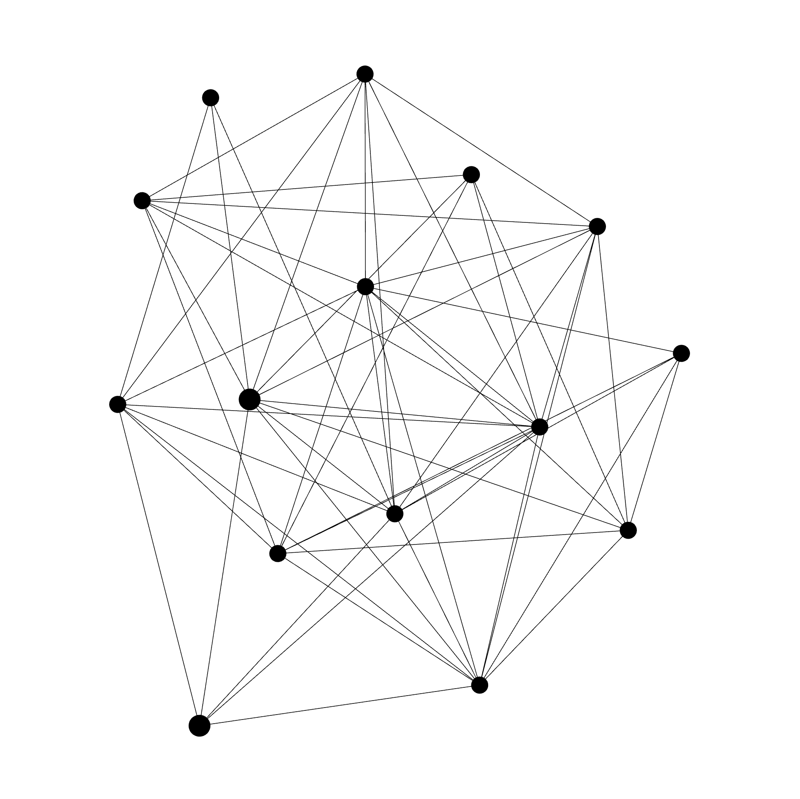
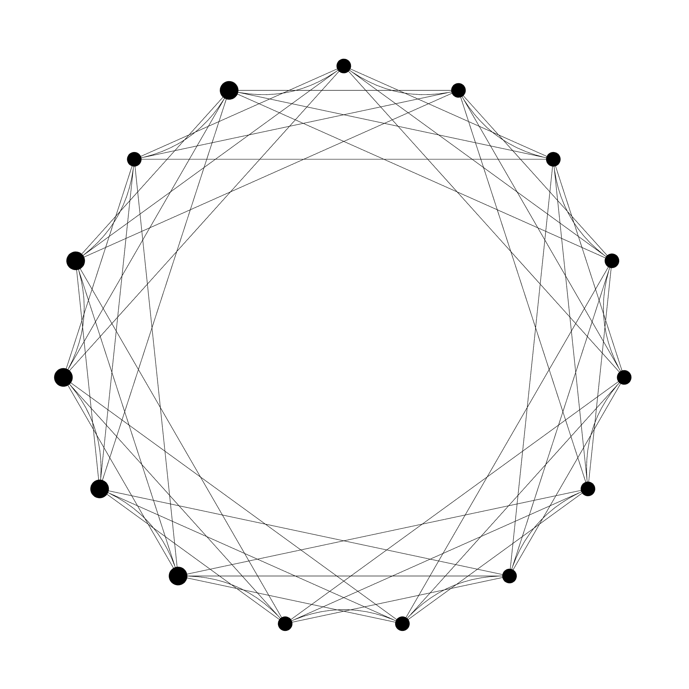
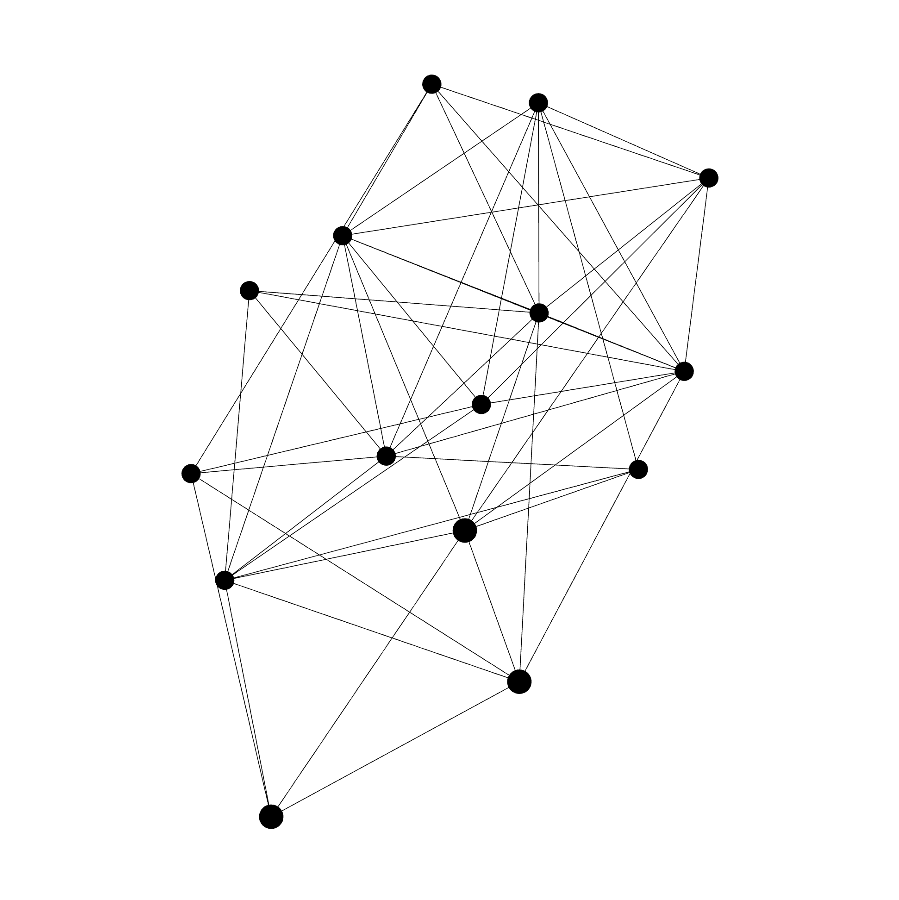
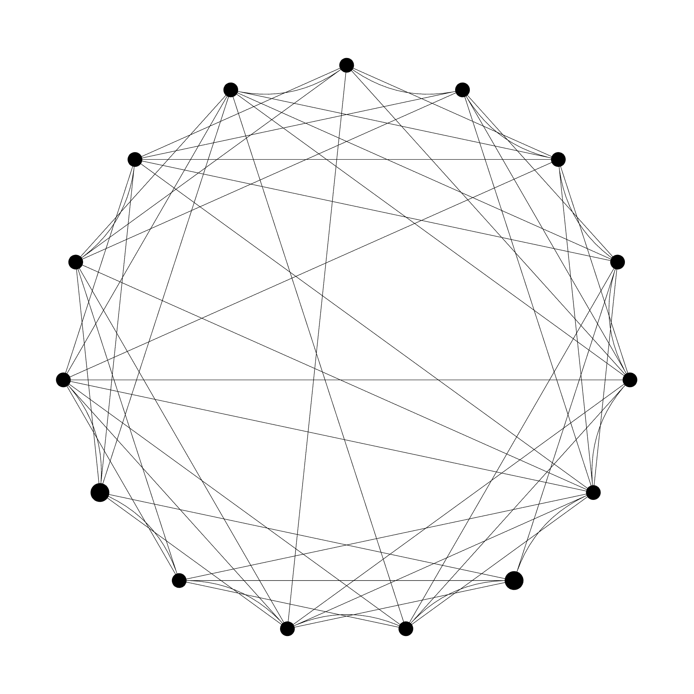

# AAron

A deterministic simulator for gossip-based message dissemination on structured networks.

```
  AAron  ●─●─●  1.0.0 · gossip-epidemic protocol simulator
```

AAron is a configurable, deterministic gossip simulator. You choose a network topology, set how each node samples its peers every round, optionally inject node failures, and run anything from a single trial to a large parameter sweep. Every run is summarised by the same nine metrics and written to disk: JSON for a single trial, CSV for a sweep.

The repository has three parts: the **simulator** engine; a **command-line interface** (`./aaron`), usable interactively or scripted, that runs single trials, custom parameter sweeps, and the thesis experiment grids; and a set of **Python analysis scripts** that turn the raw CSV output into figures and markdown reports.

AAron is also the software companion to *Topologies & Randomness in Gossip Networks* (Matteo Cannata, Maastricht University, Department of Advanced Computing Sciences, 2026), which uses it to study how much of a gossip protocol's behaviour comes from the network it runs on versus how nodes choose who to talk to. That study and how to reproduce it live in [Experiments](#experiments). To replay a finished run visually, load its `result.json` into [**AAreplay**](../AAreplay-DACS), the companion viewer in the same repository.

---

## Contents

- [Overview](#overview): what the simulator models
- [System design](#system-design): how the codebase is organised
- [Getting started](#getting-started): install, run, and your first simulation
- [Commands](#commands): the CLI reference
- [Topologies](#topologies): the four supported network types
- [Peer selection](#peer-selection): how nodes pick who to contact
- [Metrics](#metrics): the nine values recorded per trial
- [Determinism and reproducibility](#determinism-and-reproducibility): seeds and pure functions
- [Experiments](#experiments): the thesis study and how to reproduce the dataset
- [Project structure](#project-structure): where everything lives
- [Extending AAron](#extending-aaron): add a topology, metric, or command
- [Building and testing](#building-and-testing): Maven commands and the test suite

---

## Overview

The model is a single push-based gossip protocol. One node starts with the message. In each synchronous round, every node that already has the message picks a random subset of its neighbours and sends it to them. Newly reached nodes start forwarding in the next round. A run ends when one of three things happens:

- every node has the message (full dissemination),
- no new node is reached for three rounds in a row (the spread has stalled), or
- a safety cap of 1000 rounds is reached.

Each completed run is summarised by nine metrics covering **speed**, **reach**, **cost**, and **reliability** (see [Metrics](#metrics)).

Four classic network types are supported, and they share a single density parameter `k`: each is generated to the **same average degree** (`2k`), so different topologies can be compared on equal footing rather than confounding shape with density.

AAron can also inject **non-forwarding failures**: a chosen fraction of nodes still receive the message but never pass it on. This is a passive ("receive-but-don't-forward") failure model used to stress-test how well dissemination holds up when part of the network goes quiet.

---

## System design

AAron is organised as two cleanly separated layers that communicate **only through CSV files**. The **Java layer** runs simulations and writes raw per-trial data; the **Python layer** reads that data offline and turns it into figures. They never run at the same time, which keeps the simulator simple and the analysis fully reproducible.

| Layer | Component | Responsibility |
|---|---|---|
| Interface | **CLI** (`AaronCli`) | `single`, `batch`, and the four experiment grids (`rq1`, `rq2`, `rq1b`, `rq2b`) |
| Orchestration | **Experiment Runner** | seed derivation, connectivity retries, the `G × S` sweep, CSV writing |
| Engine | **Simulator** | a deterministic pure function: `Network` → `PeerSelector` → `Metrics` |
| Offline | **Analysis (Python)** | pandas aggregation, statistical-validity audit, figure generation |

The engine is reached through one small `Network` interface (`nodeCount`, `edgeCount`, `neighbors`, `edges`), so the protocol code is identical for all four topologies. Swapping the network type changes the structure under test without touching the dissemination logic, which is exactly what makes the comparison fair.

---

## Getting started

### 1. Prerequisites

| Dependency | Version | Needed for |
|---|---|---|
| JDK | 23+ | building and running the simulator |
| Python | 3.9+ | optional, only for the analysis scripts in `analysis/` |

AAron ships with the **Maven Wrapper** (`mvnw`), which downloads the correct Maven (3.9.9) automatically on the first build, so a normal setup needs only a JDK 23+.

**If the wrapper does not work** (for example there is no network access to fetch Maven, or a corporate proxy blocks the download), install [Maven](https://maven.apache.org/install.html) 3.9+ yourself and build with plain `mvn` instead, then run the jar directly:

```bash
mvn clean package -DskipTests        # build the jar without the wrapper
java -jar target/aaron-1.0.0.jar     # run it directly (replaces ./aaron)
```

Anywhere this README uses `./mvnw`, you can substitute `mvn` once Maven is installed. (The simulator is pure Java with two small libraries: picocli for the CLI and Gson for JSON.)

### 2. Build and launch

```bash
git clone https://github.com/Aladin000/Topologies-Randomness.git
cd Topologies-Randomness/AAron-DACS
./aaron            # macOS / Linux   (use  aaron  on Windows)
```

The first launch compiles the project into `target/aaron-1.0.0.jar` (via the wrapper); later launches start instantly. There are two ways to drive AAron from here: the **interactive menu** (step 3) or **direct commands** (step 4); both run exactly the same simulations.

### 3. The interactive menu

Running `./aaron` with no arguments **from a terminal** opens an interactive menu. (When output is piped or redirected, e.g. scripts or CI, the menu is skipped and AAron behaves like a normal CLI that prints help and exits.)

```
  AAron  ●─●─●  1.0.0 · gossip-epidemic protocol simulator

  1   single    one trial → JSON
  2   batch     parameter sweep → CSV
  3   rq1       reproduce RQ1 grid
  4   rq2       reproduce RQ2 grid
  5   rq1b      reproduce RQ1B grid (Byzantine)
  6   rq2b      reproduce RQ2B grid (Byzantine)
  ?   help      show full CLI help
  q   quit

  pick a number for a guided run · or type a command (e.g. rq1 -o data/rq1.csv)
  >
```

At the `>` prompt you can:

| Type | Effect |
|---|---|
| a number `1` to `6` (or the command name, e.g. `single`) | opens a **guided form** that asks for each option in turn |
| a full command, e.g. `rq1 -o data/rq1.csv` | runs it immediately (multi-line pastes ending in `\` are joined) |
| `?` or `help` | shows the full CLI help; `? single` (or `help rq1`) shows one command's help |
| `q`, `quit`, or `exit` | leaves the menu |

In a **guided form**, each option shows its `[default]`: press **Enter** to accept it, type a value to override it, type **`?`** to see what the field means, or **`q`** to cancel. After the last field AAron prints the exact command it will run and asks for confirmation:

```
  >  1

  single  ·  one simulation trial → JSON
  enter = accept default  ·  ? = explain field  ·  q = cancel

  topology            [RING]         >  SCALE_FREE
  nodes               [100]          >  500
  k                   [3]            >  6
  viewFraction        [1.0]          >
  fanOut              [3]            >
  failureProbability  [0.0]          >
  graphSeed           [42]           >
  simulationSeed      [7]            >
  output              [result.json]  >  run.json

  command:  single -t SCALE_FREE -n 500 --k 6 --viewFraction 1.0 --fanOut 3 \
            --failureProbability 0.0 --graphSeed 42 --simulationSeed 7 -o run.json

  run?  [Y]  >

  done

  press enter for menu
```

The printed command is also a ready-to-use direct command: copy it to re-run the same trial non-interactively.

### 4. Running commands directly

Every command works without the menu, which is what you want for scripts and reproducibility:

```bash
# one trial on a 20-node ring lattice, written to JSON
./aaron single -t RING -n 20 --k 3 --viewFraction 0.8 --fanOut 2 \
               --graphSeed 42 --simulationSeed 100 -o result.json

# a custom sweep: 30 networks × 50 trials, one CSV row per trial
./aaron batch -t SCALE_FREE -n 500 --k 6 --viewFraction 1.0 --fanOut 3 \
              -G 30 -S 50 --baseSeed 42 -o sweep.csv

# reproduce a thesis grid
./aaron rq1 -o data/rq1.csv
```

`./aaron --help` lists every command; `./aaron <command> --help` documents one (see [Commands](#commands)).

### 5. What a run produces

- **`single`** writes a JSON event log: the generated network, every round of the spread, and the nine summary metrics. With `-o` omitted it prints to stdout.
- **`batch`** and the `rq*` grids write a **CSV with one self-describing row per trial** (topology, `nodeCount`, `k`, `viewFraction`, `fanOut`, the `baseSeed`/`graphSeed`/`simulationSeed`, the trial index, and the nine metrics; failure runs add failure columns). Any trial can be replayed exactly by copying its `graphSeed` and `simulationSeed` into a `single` run.

**Where the file lands.** The value passed to `-o` is interpreted **relative to the directory you run `./aaron` from**, so `-o result.json` writes `result.json` into the current working directory (the repository root if you launched from there). The `rq*` commands create any missing parent directories, which is why `-o data/rq1.csv` works on a fresh clone. `single` and `batch` do **not**: they write only to the exact path given, so a target like `-o out/result.json` fails unless `out/` already exists — create the directory first, or write to an existing one.

The nine metrics are defined in [Metrics](#metrics); the Python scripts in `analysis/` turn these CSVs into the figures and reports described under [Experiments](#experiments).

### 6. Where to go next

- Reproduce the full thesis dataset and figures → [Experiments](#experiments).
- Understand the output numbers → [Metrics](#metrics).
- Add your own topology, metric, or command → [Extending AAron](#extending-aaron).

---

## Commands

| Command | What it does | Output |
|---|---|---|
| `single` | Runs one trial with explicit seeds | JSON log: the network, every round, and the metrics |
| `batch` | Custom sweep: `G` networks × `S` trials | CSV, one row per trial |
| `rq1` | Thesis topology grid (216 configurations) | CSV |
| `rq2` | Thesis peer-selection grid (400 configurations) | CSV |
| `rq1b` | `rq1` repeated under non-forwarding failures | CSV with failure columns |
| `rq2b` | `rq2` repeated under non-forwarding failures | CSV with failure columns |

`single` and `batch` accept `--failureProbability` to make each node non-forwarding with a given probability. `rq1b` and `rq2b` run the corresponding grid at two preset failure levels (0.15 and 0.30) and parallelise across configurations.

### Examples

```bash
# print a single trial to stdout instead of a file (omit -o)
./aaron single -t RANDOM -n 100 --k 6 --viewFraction 1.0 --fanOut 3 \
               --graphSeed 1 --simulationSeed 1

# custom sweep: 10 networks × 30 trials on a scale-free graph
./aaron batch -t SCALE_FREE -n 100 --k 4 --viewFraction 0.5 --fanOut 3 \
              -G 10 -S 30 --baseSeed 42 -o sweep.csv

# same sweep, but 20% of nodes are passive Byzantine (never forward)
./aaron batch -t SCALE_FREE -n 100 --k 4 --viewFraction 0.5 --fanOut 3 \
              -G 10 -S 30 --baseSeed 42 --failureProbability 0.2 -o sweep_failures.csv

# quick smoke test of a grid before a full run (tiny G and S)
./aaron rq1 -o /tmp/rq1_smoke.csv -G 2 -S 3
```

---

## Topologies

| Code | Model | Meaning of `--k` |
|---|---|---|
| `RANDOM` | Erdős–Rényi / Gilbert *G(N, p)* | edge probability `p = 2k / (N − 1)`, expected degree ≈ `2k` |
| `RING` | Ring lattice | `k` neighbours on each side, degree = `2k` |
| `SCALE_FREE` | Barabási–Albert | `m = k` edges per added node, mean degree ≈ `2k` |
| `SMALL_WORLD` | Watts–Strogatz | ring lattice with `k` per side, edges rewired with probability β = 0.1 |

The single parameter `k` has the same meaning across all four models: it sets a target **average degree of `2k`**. This is what keeps density comparable, so the four network types can be compared on equal footing.

Each network type has a minimum size (`2k + 1` for ring, random, and small-world; `k + 1` for scale-free). Every generated graph is checked for connectivity; if a random graph comes out disconnected, the generator retries with a new seed up to 100 times before reporting that configuration as unreachable.

### Visualising a run

The four panels below each show one generated network and a full gossip run on it. These graphs and simulated runs were generated with **AAron** and then replayed and visualised with [**AAreplay**](../AAreplay-DACS), the companion viewer in the same repository.

<table>
  <tr>
    <td align="center"><br><sub><code>RANDOM</code></sub></td>
    <td align="center"><br><sub><code>RING</code></sub></td>
  </tr>
  <tr>
    <td align="center"><br><sub><code>SCALE_FREE</code></sub></td>
    <td align="center"><br><sub><code>SMALL_WORLD</code></sub></td>
  </tr>
</table>

All four use `N = 15`, `k = 4`, `viewFraction = 1.0`, `graphSeed = 999`, and `simulationSeed = 4` (`RANDOM` and `SCALE_FREE` with `fanOut = 2`; `RING` and `SMALL_WORLD` with `fanOut = 3`). For example, the scale-free panel was produced with:

```bash
./aaron single -t SCALE_FREE -n 15 --k 4 --viewFraction 1.0 --fanOut 2 \
               --graphSeed 999 --simulationSeed 4 -o scale_free.json
```

---

## Peer selection

Each round, a sender decides who to contact in two steps, controlled by two parameters:

| Parameter | Range | Role |
|---|---|---|
| `--viewFraction` | (0, 1] | the fraction of a node's neighbours it can see this round |
| `--fanOut` | ≥ 1 | how many of those visible neighbours it actually contacts |

So a node first samples a *view* of size `max(1, round(viewFraction × degree))` from its neighbours, then picks up to `fanOut` peers from that view, uniformly at random and without replacement. If the view is smaller than `fanOut`, it contacts everyone in the view. Together these model partial visibility (you don't always know every neighbour) and contact effort (how aggressively you spread).

---

## Metrics

Each trial produces nine values:

| Symbol | Name | Definition |
|---|---|---|
| `T_end` | Dissemination time | rounds until the run terminates |
| `Ω` | Message count | total send events across all rounds |
| `M` | Message complexity | `Ω / (N − 1)`, messages per node that needed reaching |
| `α` | Coverage | fraction of nodes informed at termination |
| `L₀.₅` | 50% latency | first round reaching ≥ 50% coverage (`−1` if never reached) |
| `L₀.₉` | 90% latency | first round reaching ≥ 90% coverage (`−1` if never reached) |
| `L₁.₀` | Full latency | first round reaching 100% coverage (`−1` if never reached) |
| `F_eff` | Effectual fan-out | `Ω / number of informed nodes` |
| `R_run` | Reliability | `1` if every node was reached (`α = 1.0`), otherwise `0` |

Reliability is intentionally strict: a run that reaches 99% of nodes still scores `R_run = 0`. This separates "almost everyone" from "literally everyone," which matters for dissemination guarantees.

---

## Determinism and reproducibility

AAron's core (`Simulator.simulate`) is a **pure function**: no global state, no hidden randomness, no side effects. The same inputs always produce the same output, so any trial can be replayed exactly.

Two independent seeds control all randomness:

| Seed | Controls |
|---|---|
| `graphSeed` | the network structure (which edges exist) |
| `simulationSeed` | the source node, the per-round peer samples, and the non-forwarding assignment |

In the sweep commands (`batch`, `rq1`, `rq2`, `rq1b`, `rq2b`), a single `--baseSeed` deterministically derives both seed streams for every trial, so a full run produces a byte-identical CSV every time. The default base seed is `42`.

Non-forwarding assignment draws from a separate stream (`simulationSeed` XOR a fixed constant) so the failed-node set never disturbs the main simulation stream. When `failureProbability = 0.0`, that stream is untouched and the result is identical to the failure-free path.

---

## Experiments

The thesis asks how much of a gossip protocol's behaviour comes from the network it runs on versus how nodes choose who to talk to. To make that comparison fair, the study keeps the dissemination protocol fixed and varies only the underlying graph and its peer-selection parameters, generating every topology to the same average degree so differences reflect network *shape*, not density.

It is built on four simulation **suites**. Two are failure-free (`rq1`, `rq2`) and two repeat the same grids under non-forwarding failures (`rq1b`, `rq2b`) at two failure levels, `q ∈ {0.15, 0.30}`. Trade-off analysis (RQ3) adds no new simulation; it cross-analyses the existing data.

### Sampling and seeding (shared by all suites)

| Setting | Value | Purpose |
|---|---|---|
| Graphs per configuration (`G`) | 30 | structural variability across graph realisations |
| Trials per graph (`S`) | 50 | protocol variability (source node, peer samples) |
| Trials per configuration | 1,500 | stable means and distributions |
| `baseSeed` | 42 | full reproducibility (a run is byte-identical every time) |
| Watts–Strogatz `β` | 0.1 | fixed small-world rewiring constant |

### Peer-selection presets

The topology suite (and the overlapping part of the peer-selection suite) use three presets that span aggressive to minimal gossip:

| Setting | viewFraction | fanOut | Meaning |
|---|---|---|---|
| A | 1.0 | 3 | full visibility, moderate contact (standard gossip) |
| B | 0.6 | 2 | partial visibility, reduced contact |
| C | 0.2 | 1 | minimal visibility, single contact |

### The four suites

| Suite | What varies | Grid | Configs | Trials |
|---|---|---|---|---|
| `rq1` (topology) | topology × `k` × `N` at presets A/B/C | 4 × {3,6,9} × {50,100,200,500,1000,5000} × 3 | 216 | 324,000 |
| `rq2` (peer selection) | topology × `N` × viewFraction × fanOut, `k`=6 | 4 × {100,500,1000,5000} × {0.2,0.4,0.6,0.8,1.0} × {1,2,3,4,5} | 400 | 600,000 |
| `rq1b` (topology + failures) | `rq1` repeated at `q ∈ {0.15, 0.30}` | as `rq1`, ×2 | 432 | 648,000 |
| `rq2b` (peer selection + failures) | `rq2` repeated at `q ∈ {0.15, 0.30}` | as `rq2`, ×2 | 800 | 1,200,000 |

The counts above are **per suite, before merging**. Because the suites share `baseSeed`, any configuration appearing in both `rq1` and `rq2` produces identical trials; after deduplication the merged dataset contains **565 unique failure-free configurations** (847,500 trials) and, including both failure levels, **1,695 configurations and 2,542,500 trials** in total.

### Reproduce the dataset

Thanks to deterministic seeding, every CSV is byte-identical across machines and runs.

Run the commands below **from the repository root**: `requirements.txt` lives there, and the `./aaron -o data/...` paths are resolved relative to the working directory, so launching elsewhere would scatter the CSVs. (The analysis scripts themselves are path-independent — they locate `data/` relative to their own file — but running everything from the root keeps the steps consistent.)

```bash
# 1. (optional) install Python deps, only needed for the figures
#    (a virtual environment is recommended: python -m venv .venv && source .venv/bin/activate)
pip install -r requirements.txt

# 2. run the four simulation suites (this regenerates data/*.csv)
./aaron rq1  -o data/rq1.csv
./aaron rq2  -o data/rq2.csv
./aaron rq1b -o data/rq1b.csv
./aaron rq2b -o data/rq2b.csv

# 3a. regenerate the six publication-ready thesis figures
python analysis/thesis_figures.py

# 3b. (optional) regenerate the full exploratory figure set + reports
python analysis/rq1_analysis.py
python analysis/rq2_analysis.py
python analysis/rq3_analysis.py
python analysis/rq1b_analysis.py
python analysis/rq2b_analysis.py
python analysis/rq3b_analysis.py
python analysis/statistical_validity.py
```

The thesis figures land in `analysis/figures/thesis/`; the exploratory set and auto-generated reports land in `analysis/figures/rq1/` through `analysis/figures/rq3b/`. `rq3` and `rq3b` are post-hoc analyses that read the existing `rq1`/`rq2` data, so they need no extra simulation.

> **Note on row counts.** Connectivity is enforced, so any configuration whose random graphs cannot be made connected within the retry budget is reported and skipped. In practice this affects only the `Random, N = 5000, k = 3` configurations, where the target degree is too low to reliably yield a connected graph. Their trials are absent from the output by design.

---

## Project structure

```
AAron/
├── aaron, aaron.cmd                Unix / Windows launchers
├── mvnw, mvnw.cmd                  Maven Wrapper (no local Maven needed)
├── pom.xml                         Build configuration (Java 23, executable fat JAR)
├── requirements.txt                Python dependencies for analysis/
│
├── src/main/java/
│   ├── aaron/                      Network interface and the four topology generators
│   ├── simulation/                 Gossip protocol engine (deterministic, push-based)
│   ├── peerselection/              Per-round view sampling and fan-out selection
│   ├── metrics/                    The nine per-trial metrics
│   ├── experiments/                Experiment runner, parameter grids, CSV writer
│   └── cli/                        picocli commands, interactive menu, JSON writer
│
├── src/test/java/                  Unit and integration tests
│
├── analysis/
│   ├── rq1_analysis.py             Topology grid figures
│   ├── rq2_analysis.py             Peer-selection grid figures
│   ├── rq3_analysis.py             Trade-off and Pareto-frontier figures
│   ├── rq1b_analysis.py            Topology grid under failures
│   ├── rq2b_analysis.py            Peer-selection grid under failures
│   ├── rq3b_analysis.py            Trade-off figures under failures
│   ├── thesis_figures.py           The six single-panel figures used in the thesis
│   ├── statistical_validity.py     Confidence intervals and replication audit
│   ├── _style.py                   Shared matplotlib / seaborn theme
│   └── figures/                    Generated plots and reports
│
└── data/                           Experiment CSVs from rq*/batch (generated)
```

Single-trial JSON files from `single` have no fixed home: they are written wherever `-o` points, defaulting to the working directory (the repository root) when you pass a bare filename like `-o result.json`. Pick a path under an existing directory (e.g. `data/`) to keep the repository root clean.

---

## Extending AAron

The codebase is small and the extension points are deliberately narrow. The most common changes:

**Add a network topology.** The simulator only ever sees the `Network` interface (`nodeCount`, `edgeCount`, `neighbors`, `edges`), so a new structure plugs in without touching the protocol:

1. Implement `aaron.Network` in a new class (e.g. `aaron/TorusNetwork.java`).
2. Add a factory method to `aaron.AAron` (e.g. `AAron.torus(...)`).
3. Add a constant to the `aaron.TopologyForm` enum.
4. Add a `case` for it to the `switch` expressions over `TopologyForm`: in `simulation.Simulator` (network construction and minimum-size check) and `experiments.ExperimentRunner` (connectivity retry), plus the display-name maps in `experiments.CsvWriter` and `cli.JsonEventLogWriter`.

Because those `switch` expressions are exhaustive over the enum, the compiler points you at every place that still needs the new case, so you cannot forget one.

**Add a metric.** Compute it in `metrics.MetricsCalculator`, add the field to `metrics.TrialMetrics`, and emit it from `experiments.CsvWriter` (CSV column) and `cli.JsonEventLogWriter` (JSON field). Add a unit test pinning the formula.

**Add a CLI command.** Write a `@Command` class inside `cli.AaronCli` and register it in the top-level `subcommands` list; optionally wire it into `cli.InteractiveMenu` (the `SUBCOMMAND` map and a `Field` form) to give it a guided menu entry.

**Add an experiment grid.** Define the configuration list and a runner in `experiments.ExperimentSuite`, then expose it as a new CLI command as above.

After any change, run the test suite (`./mvnw test`): it pins determinism, graph symmetry, and the metric formulas, so regressions surface immediately.

---

## Building and testing

```bash
./mvnw clean package              # full build with tests
./mvnw -q package -DskipTests     # quick rebuild, no tests
./mvnw test                       # run the test suite only
```

The `./aaron` launcher builds automatically on first use, so you only need these commands for development.

The test suite covers network generation, round semantics, peer selection, all nine metric formulas, CSV and JSON output, the interactive menu, and non-forwarding behaviour. Key invariants it enforces include deterministic reproducibility, undirected-graph symmetry, connectivity conditioning, and independence between the simulation and failure seed streams.

---

## Thesis

> **Topologies & Randomness in Gossip Networks**
>
> Matteo Cannata
> Department of Advanced Computing Sciences
> Faculty of Science and Engineering, Maastricht University, 2026
>
> Supervisor: Dr. Tony Garnock-Jones

---

## License

MIT. See `LICENSE`.
